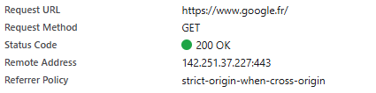
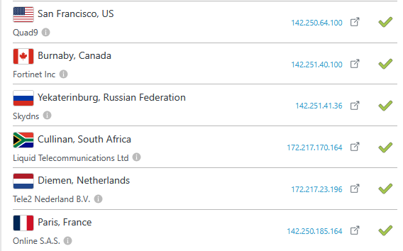
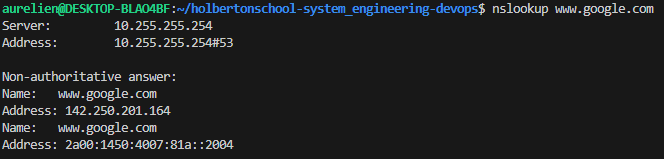
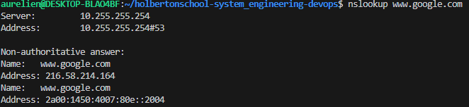

# What happens when you type google.com in your browser and press Enter


### Query path 


1. DNS request
2. TCP/IP
3. Firewall
4. HTTPS/SSL
5. Load-balancer
6. Web server
7. Application server
8. Database
  


### 1. DNS request 

 The browser sent a DNS request to resolve the domain name www.google.fr to an IP address, here:



### Explanation

__Request URL__

" https://www.google.fr/ "

This is the full URL to which the request is sent. The __https://__ indicates that the connection is secured via TLS/SSL.


__Request Method__

```
GET
```

This is an HTTP GET request, which means the browser is simply requesting a resource

__Status Code__

```
200 OK
```

This indicates that the server successfully responded to the request

__Remote Address__
```
142.251.37.227:443
```

*__IP__* : This is the address of the Google server that processed your request.

*__Port 443__* : Port used for secure HTTPS (TLS) connections.

### 2. TCP/IP

#### Introduction :
TCP/IP (Transmission Control Protocol / Internet Protocol) is a set of protocols used to enable communication between devices over the Internet or a private network. These protocols govern how data is sent and received between different systems.

#### protocole IP (Internet Protocol) :
* Handles addressing and routing of data packets.

* Each machine connected to the Internet has a unique IP address (e.g. 142.251.37.227 for Google).

* IP divides data into small packets, each with the destination address.

* Packets can take different paths through the network to reach their destination.

* IP is an unreliable protocol: it does not ensure packet order or guaranteed delivery.

#### TCP (Transmission Control Protocol) :

It establishes a reliable connection between the client (browser) and the server.

#### Fonctionnalités :

*__Sequencing__* : puts the packets in the correct order.

*__Error control__* : checks that the data arrived correctly.

*__Reissue:__* resends lost packets.

*__Flow control :__* avoids overloading the other party.

### 3. Firewall

Is a network security device that is used to control and filter network communications (inbound and outbound) between an internal network and the outside (Internet). It serves as a barrier between a secure network and an unsecured network (such as the Internet), and is designed to prevent unauthorized access while allowing legitimate connections.

__Filtering rules :__
The firewall applies predefined rules (based on criteria such as IP addresses, ports, protocols, etc.) to filter traffic. These rules can be configured to block or allow certain types of connections.


### 4. HTTPS/SSL

*HTTPS* means *__HyperText Transfer Protocol Secure__*.
It is the secure version of the HTTP protocol, which is used to transfer web pages between a server and a browser.

HTTPS security relies on an encryption protocol called SSL or more precisely TLS (the modern version).

#### SSL/TLS

* SSL = Secure Sockets Layer

* TLS = Transport Layer Security (remplace SSL, plus sécurisé)

- Encrypts the data exchanged between your browser and the server.

- Verifies the server's identity using a digital certificate.


### 5. Load-balancer 

A load balancer is a network or software component whose mission is to intelligently distribute traffic between multiple servers, also known as horizontal scalability.
It acts as a request distributor to ensure that:

- No server is overloaded

-The system remains fast, available, and reliable

- The user gets a fast and continuous response even if a server goes down.

Exemple : 
via the site https://dnschecker.org/#A/www.google.com you can observe the different IP addresses given by Google


Via Vscode : 
change of the IP given by Google





### 6. Web server

A __web server__ is a software program, such as Nginx or Apache, responsible for receiving requests sent by a browser and responding by sending the resources needed to display a website. What it does specifically:

* It handles HTTP/HTTPS requests from users.

* It returns __static content__: HTML pages, images, CSS or JavaScript files.

* If the request requires more complex processing (personalized content, user data, etc.), __it forwards the request to an application server__.


### 7. Application server

An __application server__ is software that executes the business logic of a web application. Unlike the web server, which serves static files, the application server handles __dynamic requests__, interacts with databases, and generates personalized responses for each user.

* Processes __dynamic requests__ from users (e.g.: form, login, search, etc.),

* Runs application code (PHP, Java, Python, Node.js, etc.),

* Manages business logic (calculations, rules, specific processing),

* Connects to a database to read or save information.


### 8. Database

A database is a system for storing, organizing, and accessing data used by an application. It is essential for storing information such as user accounts, products, messages, and so on.


### Conclusion 

Typing www.google.com into your browser triggers a series of invisible technical steps: DNS resolution, secure connection via HTTPS, filtering by a firewall, traffic distribution by a load balancer, processing by a web server, an application server, and then consultation of a database.

In milliseconds, all these components work together to display a web page to you, quickly, securely and reliably.
